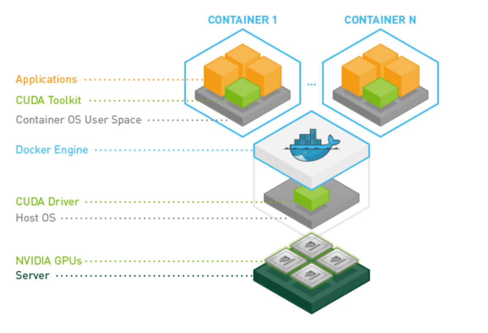
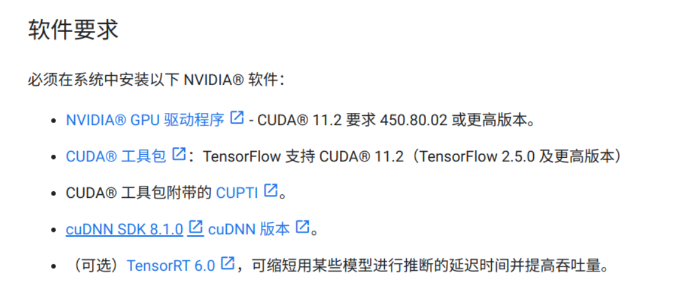

# tensorflow docker

[tensorflow docker安装指南](https://www.tensorflow.org/install/docker?hl=zh-tw)

1. 在本機主體機器上[安裝 Docker](https://docs.docker.com/install/)。

2. 如要在 Linux 上支援 GPU，請

   安裝 NVIDIA Docker 支援

   - 請使用 `docker -v` 記下您的 Docker 版本。19.03 **以前**的版本需要使用 nvidia-docker2 和 `--runtime=nvidia` 旗標。19.03 **以後**的版本則需要使用 `nvidia-container-toolkit` 套件和 `--gpus all` 旗標。您可以在上方網頁連結中找到這兩個選項。



> docker 依赖于cuda driver, 所以驱动版本不兼容会导致docker检测不到gpu

[NVIDIA container toolkit 仓库](https://github.com/NVIDIA/nvidia-container-toolkit)

[NVIDIA container toolkit installation guidance](https://docs.nvidia.com/datacenter/cloud-native/container-toolkit/latest/install-guide.html)

安装完需要`sudo systemctl restart docker.service`

* docker hub

```	
bubulamb/tensorflow-jupyter-gpu
```

# nvidia cuda

用cuda nvidia gpu运行tensorflow，环境变量配置如下：

[环境变量路径设置](https://stackoverflow.com/questions/78464430/have-to-export-cudnn-path-every-time-i-want-to-use-gpu-with-tensorflow-wsl)

```bash
export CUDNN_PATH=$(dirname $(python -c "import nvidia.cudnn;print(nvidia.cudnn.__file__)"))
export LD_LIBRARY_PATH=${CUDNN_PATH}/lib
```

如果遇到无法`import nvidia.cudnn`问题，按以下办法解决：

[安装tensorflow[and-cuda] ](https://github.com/tensorflow/tensorflow/issues/63362#issuecomment-1988630226)

执行`pip install tensorflow[and-cuda]`，即可安装`nvidia.cudnn`等库

# 安装tensorflow

[官方安装方法](https://www.tensorflow.org/install/pip?hl=zh-cn#software_requirements)

网页需要选择英文查看，因为中文更新的较慢，没有最新版本内容



[软件要求](https://tensorflow.google.cn/install/gpu?hl=zh-cn)

```bash
# apt-get 卸载方法
sudo apt-get -y install cudnn-cuda-12

sudo apt-get remove cudnn-cuda-12
sudo apt autoremove
```

# nvidia

[NVIDIA驱动](https://www.nvidia.com/drivers)

[NVIDIA toolkit](https://developer.nvidia.com/cuda-toolkit-archive)

[cuDNN](https://developer.nvidia.com/cudnn)

```bash
# 卸载nvidia驱动
sudo apt remove --purge nvidia*
# 下载驱动,并安装
chmod  +x NVIDIA-Linux-x86_64-470.103.01.run
sudo  ./NVIDIA-Linux-x86_64-470.103.01.run -no-opengl-files -no-x-check
# 或者
bash NVIDIA-Linux-x86_64-470.103.01.run
```

<https://blog.csdn.net/CarolineWang1026/article/details/123100307>

******************************

$cuda$ 安装目录`/usr/local/cuda`

[cuda和nvidia驱动版本对照表](https://docs.nvidia.com/cuda/cuda-toolkit-release-notes/index.html)

[安装cuda后环境变量配置](https://docs.nvidia.com/cuda/cuda-quick-start-guide/index.html)

```bash
export PATH=/usr/local/cuda-12.5/bin${PATH:+:${PATH}}
export LD_LIBRARY_PATH=/usr/local/cuda-12.5/lib64\${LD_LIBRARY_PATH:+:${LD_LIBRARY_PATH}}
```

## Q&A

* 问题：

  ```bash
  Cannot dlopen some GPU libraries.
  ```

  解决办法：

  <https://stackoverflow.com/questions/60208936/cannot-dlopen-some-gpu-libraries-skipping-registering-gpu-devices>

## 版本

```
tensorflow                   2.17.0
tensorflow-io-gcs-filesystem 0.37.1

Cuda compilation tools, release 12.4, V12.4.131
Build cuda_12.4.r12.4/compiler.34097967_0

NVIDIA-SMI 550.90.07
Driver Version: 550.90.07
CUDA Version: 12.4 
```

